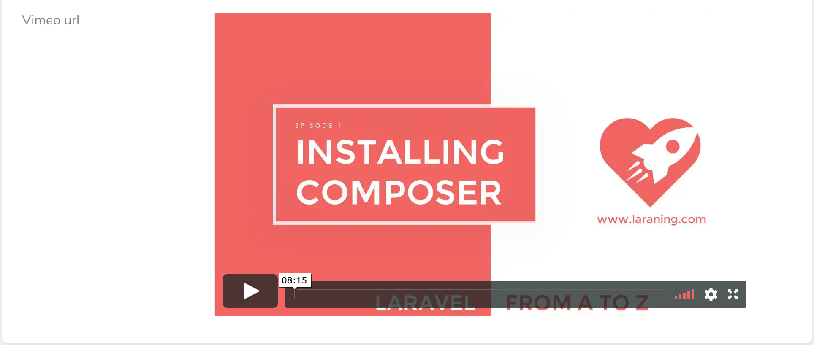

# Nova Vimeo-Field




## Installation

You can install the package in to a Laravel app that uses Nova via composer:
```bash
composer require tanjemark/vimeo
```

## Usage
```php
Vimeo::make('Vimeo field name'),
```
The field extends the base Laravel\Nova\Fields\Field, so all the usual methods are available.

## Options

### With meta
```php
Vimeo::make('Vimeo field name')
    ->withMeta([
        'options' => [
            'width' => 640,
            'height' => 360,
        ]
    ]);
```

## License
The MIT License (MIT). Please see License File for more information.

